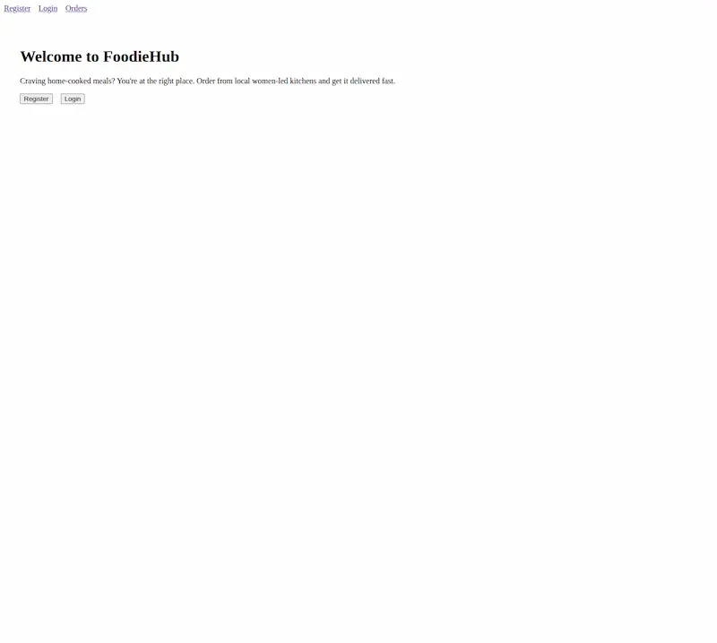
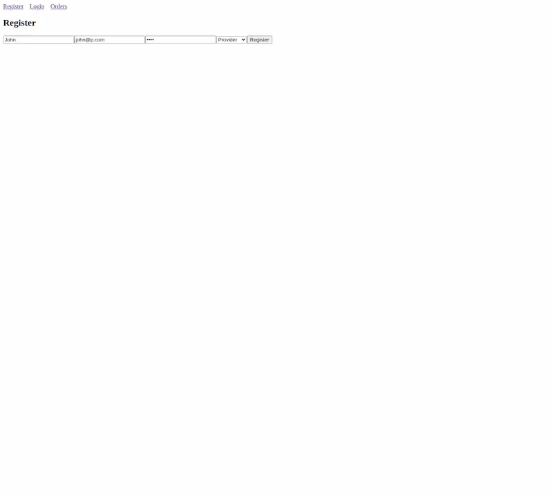
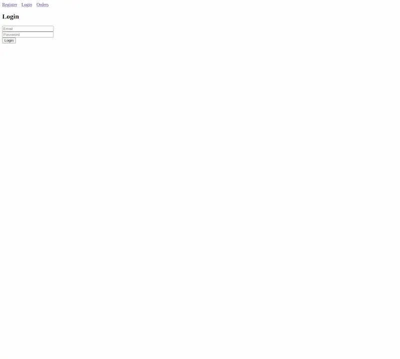
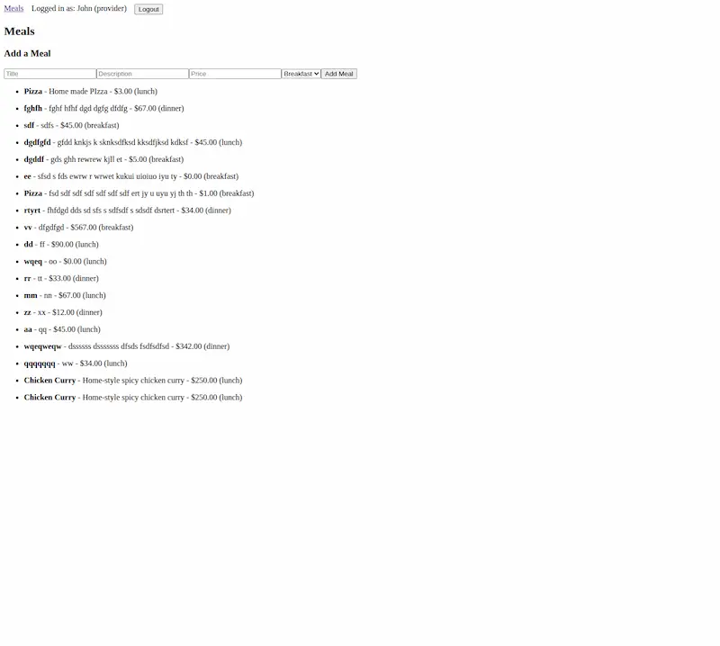
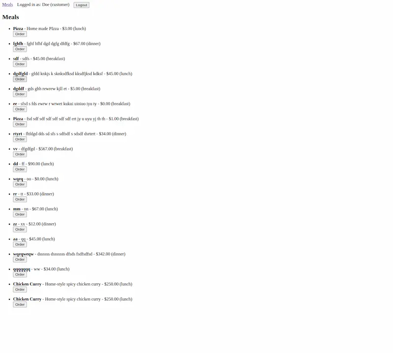
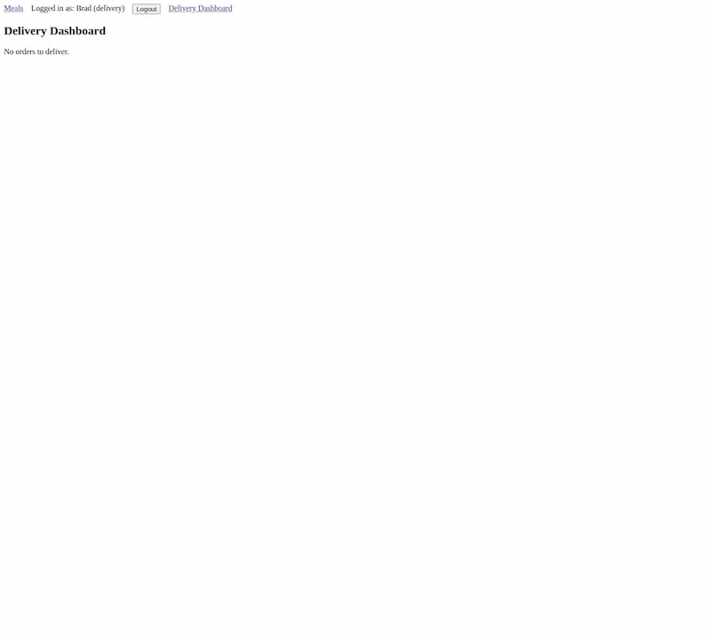

# Food Delivery App (Work In Progress)

A full-stack food delivery platform built with **React**, **Node.js**, **Express.js**, and **PostgreSQL**, inspired by real-world apps like DoorDash and Uber Eats. This app empowers **home-based female food providers**, targets customers who crave home-style meals, and supports three user roles: **Customer**, **Provider**, and **Delivery**.

---

## Live Demo

<!-- 🌐 [Live Frontend on Netlify](https://your-netlify-link.netlify.app)
🔙 [Live Backend on Render](https://your-backend-api.onrender.com) -->

---

## Features

**Authentication & Authorization**

- JWT-based login/registration for 3 roles (Customer, Provider, Delivery)
- Role-based protected routes

  **Meals**

- Providers can add, edit, and delete meals
- Customers can browse and order meals
- Real-time meal updates on frontend

  **Orders**

  - Customers can place orders
  - Providers and delivery staff can view and manage orders
  - Status tracking: placed → accepted → delivered

  **Responsive UI**

- Mobile-first design with full responsiveness for desktop, tablet, and phone
- Dark mode support (coming soon)

---

## Screenshots

| Home Page                                                  | Register                                                   | Login                                                | Provider's meals                                                          | Customer's meals                                                           | Delivery's meals                                                             | Delivery Dashboard                                                              |
| ---------------------------------------------------------- | ---------------------------------------------------------- | ---------------------------------------------------- | ------------------------------------------------------------------------- | -------------------------------------------------------------------------- | ---------------------------------------------------------------------------- | ------------------------------------------------------------------------------- |
|  |  |  |  |  |  |  |

---

## Tech Stack

### Frontend (React)

- React Router DOM
- Context API for global auth state
- Fetch API for backend integration

### Backend (Node.js + Express)

- RESTful API structure
- JWT Auth with middleware
- PostgreSQL database using `pg`

### Database

- PostgreSQL
- Relational schema with tables for Users, Meals, and Orders

---

## Folder Structure

food-delivery-app/
├── client/ # React frontend
│ └── src/
│ ├── components/
│ ├── pages/
│ ├── contexts/
│ └── App.jsx
├── server/ # Node.js backend
│ ├
│ ├── routes/
│ ├
│ ├── middleware/
│ └── server.js

---

## Getting Started

### 1. Clone the Repository

```
git clone https://github.com/pbain63/food-delivery-app.git
cd food-delivery-app
```

### 2. Setup Backend

```
cd server
npm install

# Create a .env file and configure PORT, JWT_SECRET, DATABASE_URL
npm start
```

### 3. Setup Frontend

```

cd client
npm install
npm run dev
```

---

## Environment Variables

Backend .env example:

```
PORT=5000
DATABASE_URL=your_postgres_connection_string
JWT_SECRET=your_jwt_secret_key
```

---

## API Endpoints

```
POST /api/register - Register a user
POST /api/login - Login and receive JWT
GET /api/profile - Get logged-in user profile
GET /api/meals - Get all meals (customer)
POST /api/meals - Add a meal (provider)
GET /api/orders - View orders by role
POST /api/orders - Place a new order

```

---

## Future Improvements

- Stripe Payment Integration

- Admin Dashboard

- Real-time order tracking (WebSocket)

- Multilingual support

- Ratings and reviews

---

## Contributing

Pull requests are welcome! For major changes, please open an issue first.

---

## License

MIT License

---

## About the Author

Made with ❤️ by Prodip Bain

- Trainee Full-Stack Developer
- [My Portfolio](https://pbain63.github.io/portfolio)
- prodipbain63@gmail.com

---
